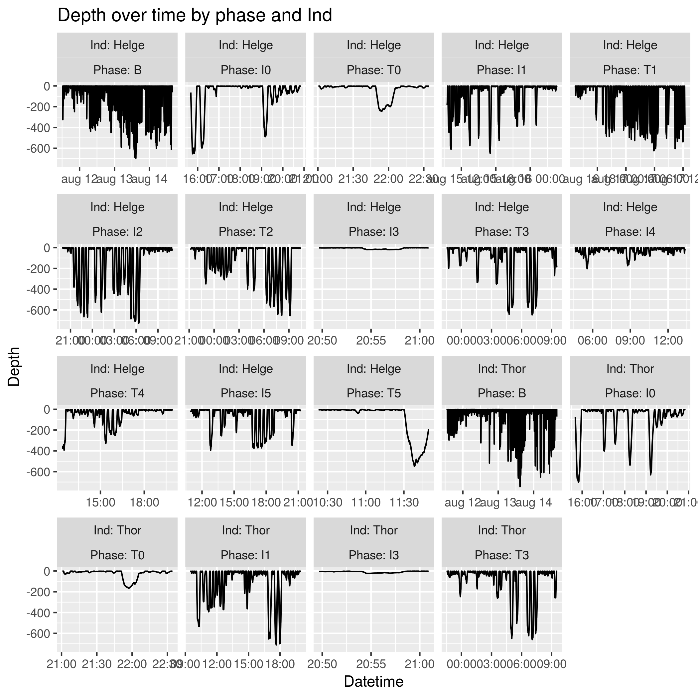
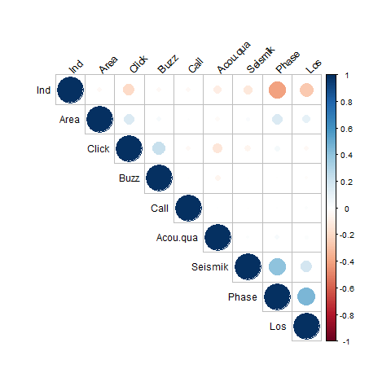
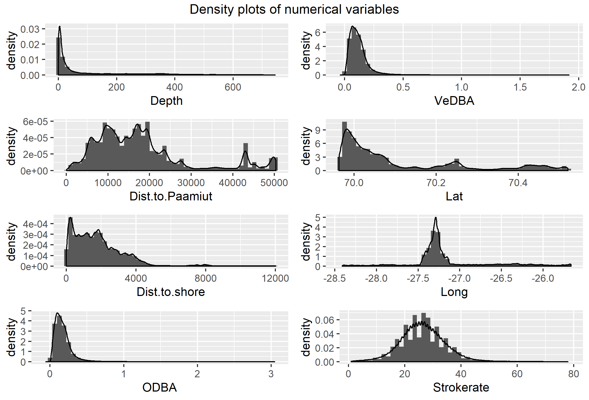
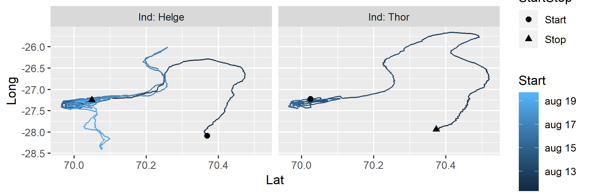
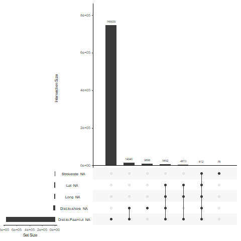
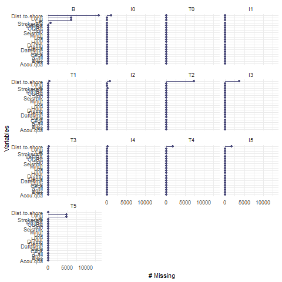
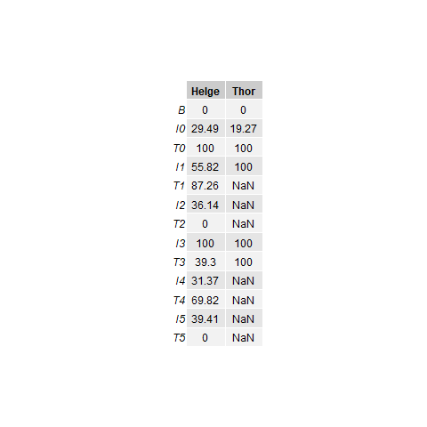

```{r setup, include=FALSE}
library(kableExtra)
library(dplyr)
knitr::opts_chunk$set(eval = TRUE)
```


```{r read_data, include=FALSE}
fullrun <- TRUE
if (fullrun) {
  narwhal <- readRDS("outputs/narwhal_modified.RDS")
} else {
  narwhal <- readRDS("outputs/narwhal_modified_reduced.RDS")
}
```


In this report we will attempt to understand if the whales are affected by the presence of the seismic ship. We will be considering the following valiables as measures of the whales behaviour

* `Depth`: Depth of the whale in meters belows sea level
* `Call`: Whether a whale makes a call
* `Click`: Wheter a whale makes a click
* `Buzz`: Whether a whale makes a buzz
* `ODBA`: Overall dynamic body acceleration
* `VeDBA`: Vector dynamic body acceleration
* `Strokerate`: Strokrate of tail of the whale

These variables are all potential response variables or will be used to create response variable. 

# Data clean up
Before we can analyse the data we must clean up the data. The data set contains 1.058.507 data lines over 19 variables. From the description of the data in the problem description we can make the following initial changes:

* Combine `Date` and `Hour` to a new single time object called `Datetime`.
* Correct for positve `Depths` by substracting maximum value from all values
* Encode -1 as NA for those variables, where it applies

Lastly there are a few issues of duplicate observations. There were 16 identical observations and 4 observations which only differed in `Dist.to.Paamiut`. Looking at the table below we see that all 16 identical observations has `Dist.to.Paamiut` = NA.
For the 16 identical observations, the duplicates was deleted from the data set. The observation pairs 9,10 and 11,12 only differs very slighty in `Dist.to.Paamiut` so two new observations with `Dist.to.Paamiut` equal to the mean of `Dist.to.Paamiut` in each pair and all other attributes the same.    

```{r, echo=FALSE}
Alldups <- readRDS("outputs/AllDuplicates.RDS")
Twodups <- readRDS("outputs/TwoDuplicates.RDS")
row.names(Twodups)[1:2] <- c("  "," ")
dups <- rbind(Alldups,Twodups)
dups[,c("Datetime","Ind","Depth","Dist.to.Paamiut")] %>%
  mutate(Dist.to.Paamiut = 
           cell_spec(Dist.to.Paamiut,
                     bold = ifelse(is.na(Dist.to.Paamiut), FALSE,TRUE),
                     color  = ifelse(is.na(Dist.to.Paamiut), "black","red"))) %>% 
kable(escape = F) %>% 
kable_styling(bootstrap_options = "striped", full_width = F, position = "left") %>% 
group_rows("Replacement for rows 9 and 10", 21, 21) %>%
group_rows("Replacement for rows 11 and 12", 22, 22) %>% 
row_spec(9:12,background = "#fca9b6") 
```


In the data for the whale Thor the first 587 **INSERT CORRECT NUMBER** lines have many `NA`'s. Therefore  we assumed that this is because the experiments were not yet properly started and we have simply removed these data lines. 

**Dette skal slettes** Furthermore a closer inspection of the `phase` variable reveals that the naming of the different levels of the variable does not correspond to description of the variable. Specifically, the Trial and Intermediate indicators ("Tx" and "Ix") in the name of the levels does not correspond to the expected seismic activity (1 and 0 respectively). Further, the ordinal part of the name of the variables (0 through 5) does not correspond to the expected time of measurement - that is, we expect T2 to be conducted before T3, but this is not the case in the data. This is allso illustrated in Figur 1 below. 

<div style="text-align:center">
**PLOT : PHASE PROBLEMER**<br>
*Figur 1*: **DESCRIPTION OF PLOT.**<br>
We see that if we adjust for the two problems mentioned above, we see that our expectations are met in a third way: between each trial there is an intermediate period.
</div>


As we can not contact the data collectors we have simply assumed that the aforementioned problems are caused by a naming error. Hence we have created a new phase variable `Newphase`. This variables correctly encodes whether we are in a trial or intermediate period, and the following number is ordinal. 
**Slettes herned til** 

As a small novelty we have looked up the sunrise and sundown times august 16th 2017 latitude 70, longitude -27. The sun would have risen at 02:49 and went down at 20:50. From this data we have encoded a `Sun` varibale encoding whether or not the sun was up or down at the time. <br>


### Aggregrating the data
The data we are considering is in fact time series data and as such it is not well suited for the types of models we are interested in. Furthermore the data set is quite large - it has more then a million data lines - and any fitting and plotting procedure will be a bit slow. To deal with this we have created a summarizing function `find_sub_data`, which given a vector of groups will aggregrate data according to the groups found in the input vector. The output of this function is then a data frame with 19 variables. 

```{r find_sub_data, eval = FALSE}
find_sub_data <- function(x) {
  X <- narwhal_summarised <- narwhal %>%
    group_by((!!as.name(x)), Ind) %>%
    summarise(Start = min(Datetime, na.rm = T),
              End = max(Datetime, na.rm = T),
              Depth = mean(Depth, na.rm = T),
              Seismik = mean(as.numeric(Seismik) - 1, na.rm = T),
              Phase = first(Phase),
              Area = first(Area),
              Call = mean(as.numeric(Call) - 1, na.rm = T),
              Acou.qua = mean(as.numeric(Acou.qua) - 1, na.rm = T),
              Dist.to.Paamiut = mean(Dist.to.Paamiut, na.rm = T),
              Dist.to.shore = mean(Dist.to.shore),
              Click = mean(as.numeric(Click) - 1, na.rm = T),
              Buzz = mean(as.numeric(Call) - 1, na.rm = T),
              ODBA = mean(ODBA, na.rm = T),
              StrokeRate = mean(Strokerate, na.rm = T),
              Los = first(Los),
              Sun = first(Sun)
    )
  X <- X[ ,-1]
  X$Dive <- X$Depth > 10
  X$Duration <- as.numeric(X$End - X$Start)
  return(X)
}
```


We can then interpret the new variables formed by a vector of groups in the following way

* `Ind`; factor;  whale name
* `Start` date time; first time point in the group
* `End` date time; last time point in the group
* `Depth` numeric; average depth
* `Seismik` numeric; average number of seismic activity pr second
* `Phase` factor; phase of the first observation
* `Area` factor; area of the first observation
* `Call` numeric; average number of calls pr second
* `Acou.qua` numeric; the average acoustic quality
* `Dist.to.Paamiut` numeric; average distance to Paamiut 
* `Dist.to.shore` numeric; average distance between the whale and the shor 
* `Click` numeric; average number of clicks pr second
* `Buzz` numeric; avrage number of buzz's pr second
* `ODBA` numeric; average overall dynamic body acceleration
* `StrokeRate` numeric; average stroke rate
* `Los` factor; whether the whale was in the line of sight in the first observation
* `Sun` factor; whether the sun was up or down at this time point 
* `Dive` logical; whether the whale was diving (diving starts at 10 meters)
* `Duration` numeric;  the time diration of the group


##### Chosing a vector of groups
As each data line corresponds to 1 second the first summarizing method that springs to mind, is simply summarizing every minute or every 10 minutes. Another interesting grouping is based on dives, where we define a dive as the whale being below 10 meters. In this grouping each dive is its own group and each time the whale is near the surface again is also a group.

**WHY ARE THESE DATA GROUPINGS INTERESTING**


## Exploratory analysis
Now that data is complete we can take a more detailed look at the individual variables. As the dataset consits of 21 variables, we will plot and analyze these variables in groups. 


### The potential response variables
Let us first look at our potential respons variables. 

```{r sum_response}
summary(narwhal[,c("Depth", "ODBA", "VeDBA", "Strokerate", "Call", "Click", "Buzz")])
```

**HERE WE WILL ALSO BE ADDING NEW VARIABLES** :  


*Removing variables and observarions*: We can remove variables from the data, as some variables describe the same phenomena. 

* `ODBA` and `VeDBA` both describe the body acceleration of the whales and the two variables are extremly correlated with a correlation coefficient of 0.995. We remove the variable `VeDBA` from the data set.
* `Call`, `Buzz`, `Click` ------ **WILL WE BE REMOVING THESE**




### The categorical explanatory variables
```{r sum_cat_explanatory}
summary(narwhal[,c("Seismik", "Phase", "Area", "Acou.qua", "Ind", "Los")])
```

A correlation plot for the categorical variables gives the impression that there is no extreme correlation betwwen the categorical variables:



Therefore the above plot does not force us to disregard any of the variables.

However, a closer inspection yields that the variables `Seismik` and `Phase` are indeed very correlated. Indeed, we see that

```{r}
sapply(levels(narwhal$Phase), function(x) summary(narwhal$Seismik[narwhal$Phase == x]))
```

Hence `Seismik` is completely determined by `Phase`.


### The numeric explanatory variables
```{r sum_num_explanatory}
summary(narwhal[,c("Dist.to.Paamiut", "Dist.to.shore", "Lat", "Long")])
```



Vi ser at

* Strokerate er "hakket" fordi det kun er integers



```{r summaries}
summary(narwhal[,c(3:19)])
table(narwhal[,c("Ind","Phase")])
```


### Ideas/Thoughts

* Make a binary *Phase* variable with level *T* and *I*
* Partion binary variables (such as *Calls*) into intervals (e.g. 30 second intervals around each call)
* Make A binary *Diving* variable by partioning the Depth variable.
* Pay attention to *Data leakage* (When you predict something using data which is not availiable at prediction time.)
* Make correlation plot
* Area is likely just a Long and Lat with broader categories
* Should we use both whales? Given that one of the appears only in some trials 


##Time of day factor
**Skal nok slettes, da vi har variabel med sol nu**
Since the time of day (e.g. morning, night) may have an influence on whale behaviour, we need to adjust for this. Indeed, one could imagine that the whale is more active when there is sunlight. Conversely, however, it could also be imagined that the researchers were more active in the day, and hence the Trial periods were conducted when there was sunlight. As such, the time of day may be a confounder between whale activity and seismic activity. 

Therefore we construct a factor variable with four levels indicating whether the measurement has been done in the the >>morning/noon/evening/night<<. We call this variable >><<....


## Data Analysis

We wish to examine whether or not the behaviour of the whales is affected by the boat and airgun.

For this purpose we will fit a generalized linear model over our aggregated data and estimate the true parameters of our various explanatory variables. 


## Conclusion

## Appendix


#Missing values
As already mentioned the dataset has quite a lot of missing values. In order to examine whether there is some systematism behind which values are missing, we plot the intersection of missing values:


We see that almost all missing values are present in the `Dist.to.Paamiut` variable, and that there is no clear tendency that other variables are missing simultaneously. Further, in order to check when the missing values appear, we plot the number of missing variables as a funtion of the phases (except for `Dist.to.Paamiut`):



We see that none of the variables used in the model are missing.

Lastly, we make a table for when `Dist.to.Paamiut` values are present (0 is no values present in the phase, 100 is all values present, NaN is when no observations belong to the corresponding whale):



We see that except for the B phase, there is no clear tendency as to when values are present or not.
**INDSÆT EVT PLOT MED DISTANCE + Missing + phases**


