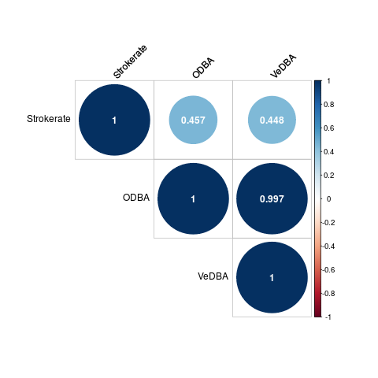
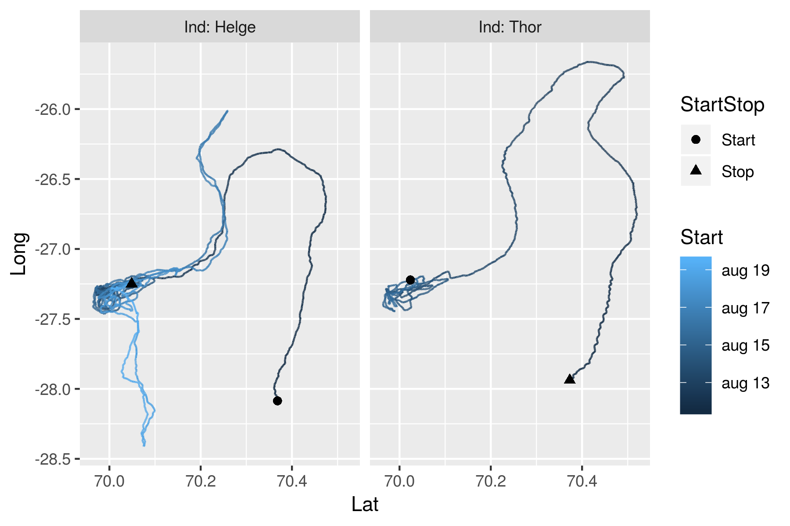
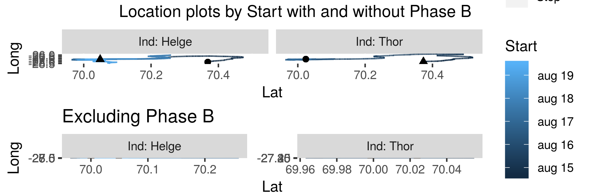
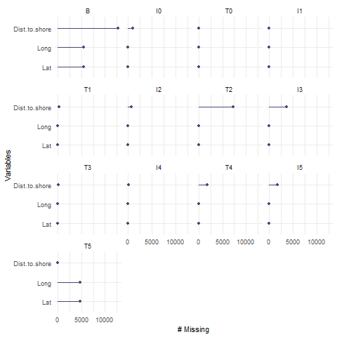

```{r setup, include=FALSE}
library(kableExtra)
library(dplyr)
knitr::opts_chunk$set(eval = TRUE)
```


```{r read_data, include=FALSE}
fullrun <- TRUE
if (fullrun) {
  narwhal <- readRDS("outputs/narwhal_modified.RDS")
} else {
  narwhal <- readRDS("outputs/narwhal_modified_reduced.RDS")
}
```

In this report we will attempt to understand if the whales are affected by the presence of the seismic ship. We will be considering the following variables as measures of the whales behaviour:

* `Depth`: Depth of the whale in meters belows sea level
* `Call`: Whether a whale makes a call
* `Click`: Wheter a whale makes a click
* `Buzz`: Whether a whale makes a buzz
* `ODBA`: Overall dynamic body acceleration
* `VeDBA`: Vector dynamic body acceleration
* `Strokerate`: Strokrate of tail of the whale

As we are interested in modelling the whales behaviour these variables are all possible response variables in the final data analysis.  

# Data clean up/preparation
Before we can analyse the data we must clean up the data. The data set contains 1.058.507 data lines over 19 variables. From the description of the data in the problem description we can make the following initial changes:

* Combine `Date` and `Hour` to a new single time object called `Datetime`.
* Correct for positve `Depths` by substracting the maximum value from all values
* Encode -1 as NA for those variables, where it applies

### Duplicate observations 
There are a few issues of duplicate observations. There were 16 identical observations and 4 observations which only differed sligthy in `Dist.to.Paamiut`. Looking at the table below we see that all 16 identical observations has `Dist.to.Paamiut` = NA.
For the 16 identical observations, one of each duplicates was deleted from the data set. The observation pairs 9, 10 and 11, 12 only differs very slighty in `Dist.to.Paamiut` so two new observations with `Dist.to.Paamiut` equal to the mean of `Dist.to.Paamiut` in each pair and all other attributes the same were added instead.    

```{r Duplicate_table, echo=FALSE}
Alldups <- readRDS("outputs/AllDuplicates.RDS")
Twodups <- readRDS("outputs/TwoDuplicates.RDS")
row.names(Twodups)[1:2] <- c("  "," ")
dups <- rbind(Alldups,Twodups)
dups[,c("Datetime","Ind","Depth","Dist.to.Paamiut")] %>%
  mutate(Dist.to.Paamiut = 
           cell_spec(Dist.to.Paamiut,
                     bold = ifelse(is.na(Dist.to.Paamiut), FALSE,TRUE),
                     color  = ifelse(is.na(Dist.to.Paamiut), "black","red"))) %>% 
kable(escape = F) %>% 
kable_styling(bootstrap_options = "striped", full_width = F, position = "left") %>% 
group_rows("Replacement for rows 9 and 10", 21, 21) %>%
group_rows("Replacement for rows 11 and 12", 22, 22) %>% 
row_spec(9:12,background = "#fca9b6") 
```

### NAs in `Strokerate`

Examing `Strokerate` after these operations shows that it has 686 NA values. The time periodes where these NA values occur are shown in the table below.

```{r Strokerate_NAs, echo=FALSE}
NAStrokeDf <- readRDS("outputs/NAStrokeDf.RDS")
kable(NAStrokeDf) %>% 
  kable_styling(bootstrap_options = "striped", full_width = F, position = "left") %>% group_rows("NA intervals", 1, 3) %>%  group_rows("Time range for whole experiment", 4, 5) 
```

We see that Helge only has NAs in the first 32 measurements. Thor has in the first 578 measurements and the last 76 measurements. We assume that the first NAs are because the experiments were not yet properly started and the last are from the experiment "winding down". As these observations are such a small fraction of the full dataset we simply remove them.
Thus the first 578 and last 76 observations are removed from "Thor" and the first 32 observations are removed from "Helge".

### NAs in `Dist.to.Paamiut`

### Sun as factor

As a small novelty we have looked up the sunrise and sundown times august 16th 2017 latitude 70, longitude -27. The sun would have risen at 02:49 and went down at 20:50. From this data we have encoded a `Sun` varibale encoding whether or not the sun was up or down at the time. <br>

### Aggregrating the data
The data we are considering is in fact time series data and as such it is not well suited for the types of models we are interested in. Furthermore the data set is quite large - it has more then a million data lines - and any fitting and plotting procedure will be a bit slow. To deal with this we have aggregrated the data, such that each data line corresponds to 1 minut. This gives us a new data set with the following summary statistics

* `Ind`; factor;  whale name
* `Start` date time; first time point in the group
* `Depth` numeric; average depth
* `Seismik` numeric; average number of seismic activity pr second
* `Phase` factor; phase of the first observation
* `Area` factor; area of the first observation
* `Call` numeric; number of calls that minut
* `Acou.qua` numeric; the average acoustic quality
* `Dist.to.Paamiut` numeric; average distance to Paamiut 
* `Dist.to.shore` numeric; average distance between the whale and the shor 
* `Click` numeric; number of clicks that minut
* `Buzz` numeric; number of buzz's that minut
* `ODBA` numeric; average overall dynamic body acceleration
* `VeDBA` numeric; average vector dynamic body acceleration
* `StrokeRate` numeric; average stroke rate
* `Los` factor; whether the whale was in the line of sight in the first observation
* `Lat` numeric; average latitude
* `Long` numeric; average longitude
* `Sun` factor; whether the sun was up or down at this time point 
* `Dive` logical; whether the whale was diving (diving starts at 10 meters)


# Exploratory data analysis

Now that we have our final dataset of 17.632 observations we can take a more detailed look at the individual variables. As the dataset consits of 20 variables, we will plot and analyze these variables in groups. 

### The potential response variables
Let us first look at our potential respons variables. 

```{r new_data_readin, include=FALSE}
narwhal <- readRDS("outputs/narwhal_Minut.RDS")
```


```{r sum_response}
summary(narwhal[,c("Depth", "ODBA", "VeDBA", "Strokerate", "Call", "Click", "Buzz")])
```
{width=750px}

We note that

* `Depth` is very skewed with a mean much larger than the median and a max value much greater that both median, mean and 3rd. quantile.
* `ODBA` and `VeDBA` are on the same magnitude and both have some negative values.
* `Call` and `Buzz` are close in their distribution of 0/1 but `Click` are not.
* `Strokerate` are positive and the plot is "jagged" because it is integers only.

We suspect that `ODBA`, `VeDBA` and `Strokrate` could be linearly correlated as they are all measurements of movement speed. We plot the spearman correlations:

{width=500px}

Which unsurprisingly shows nearly perfect positive correlation between `ODBA` and`VeDBA`. It also shows a weak to moderate positive correlation between `Strokerate` and `ODBA`, `VeDBA`.

```{r include=FALSE}
# * `Call`, `Buzz`, `Click` ------ **WILL WE BE REMOVING THESE**
```

### The categorical explanatory variables
```{r sum_cat_explanatory}
summary(narwhal[,c("Seismik", "Phase", "Area", "Acou.qua", "Ind", "Los")])
```

We note that

* We have more observations on the whale "Helge" than on "Thor"
* `Acou.qua` are almost always "G".
A correlation plot for the categorical variables gives the impression that there is no extreme correlation betwwen the categorical variables:


Therefore the above plot does not force us to disregard any of the variables.

However, a closer inspection yields that the variables `Seismik` and `Phase` are indeed very correlated. Indeed, from the table below we see that `Seismik` is completely determined by `Phase`.

```{r, echo=FALSE}
x <- sapply(levels(narwhal$Phase), function(x) summary(narwhal$Seismik[narwhal$Phase == x]))
kable(data.frame(x)) %>% kable_styling(bootstrap_options = "striped", full_width = F, position = "left")
```

### The numeric explanatory variables
```{r sum_num_explanatory}
summary(narwhal[,c("Dist.to.Paamiut", "Dist.to.shore", "Lat", "Long")])
```

{width=750px}

Since Lat and Long together determines an position we can't conclude anything about locations from looking at their densities. 

{width=750px}
{width=750px}

## Depth and phases:

By plotting the depth over time - colored according to phases - we see that the whales do a lot of short dives, and some very deep dives. We judge that there is no clear trend in time, nor any clear effect of the different phases. Considering the B phase as a control phase, there is also no clear difference before and during the experiments.


### Conclusions and choices made from exploratory data analysis

* `ODBA` and `VeDBA` are strongly correlated and either can be chosen as a response.
* By looking at `Depth` we can partion the data into distintive Dives.
* **SOMETHING WITH NAs in DIST TO PAARMIUT**

### Choices made from exploratory data analysis

* Remove `Dist.to.Paamiut`


## Aggregation of phases

In the following data analysis, we will fit models to a factor consisting of the different phases as well as a aggregated factor of the phases, differentiating only between whether or not we are in a Test phase (i.e. if there is seismic activity from the airgun or not). 

# Data Analysis and modeling

We wish to examine whether or not the behaviour of the whales is affected by the boat and airgun.

For this purpose we will fit a generalized linear models over our aggregated datasets and estimate the true parameters of our various explanatory variables. 

In the following we will present some different models with different response variables. We have chosen the four response variables Depth, Click, Call and Strokerate. We will perform both Ridge regression and standard regression for each of the four variables.

We choose to present these four models as these were the order in which the models have been fitted, and in the following analysis it will be argued that the first three of these are unsatisfactory and hence will be disregarded. However, as the analysis will also show, our fourth model has a reasonable fit.

## Model 1: Depth (And Click / Call models)

We fit a generalized linear model with Depth as a response variable. We choose the exponential family to be the Poisson family, since this family is useful for **HVORFOR**

```{r, eval = FALSE}
fit.depth <- glm(Depth ~ Phase + Area + Ind + Los + Sun + ODBA, data = DATA, family = "poisson")
fit.depth.sub <- glm(Depth ~ Phasesub + Area + Ind + Los + Sun + ODBA, data = DATA, family = "poisson")
```


Fitting these models and simulating 8 new datasets with the fitted models as the true models yields the following plots:


Quite clearly in both plots, one of the residual plots vary from the others. We conclude that the Depth model does not describe any relationship between the descriptive variables that may be in the original dataset.

The models were we instead have Click or Call as response variable also yield residual plots with one very distinguishable dataseet, and so we also disregard these models.

## Strokerate model

Similary, we fit a generalized linear model now with the Strokerate variable as response:

```{r, eval = FALSE}
fit.strokerate <- glm(StrokeRate ~ Phase + Area + Ind + Los + Sun + ODBA, data = DATA, family = "poisson")
fit.strokerate.sub <- glm(StrokeRate ~ Phasesub + Area + Ind + Los + Sun + ODBA, data = DATA, family = "poisson")
```
  


While the original dataset is still distinguishable among the 8 simulated datasets, it does look like the data could be distributed as the model predicts - however, the tails seem a bit too heavy. As a next step, we could add splines to the model in e.g. the different quantiles and see whether the heavy tails could be fixed. The price, however, would be less interpretability of the model.


## Conclusion

Our analysis of the dataset started out with a thought cleaning of the data. Firtsly, we combined some variables, removed colinear variables and aggregated the data into intervals, so that the dataset did no longer consist of time series data. Further, by plotting different explanatory variables, we deemed some variables to not have any significance for the response variables we had selected beforehand. These explanatory variables were then discarded.

We then continued into the analysis of our dataset. We tested various models for our selected response variables, but only the model of strokerate seemed to be somewhat accurate. However, even this model had problems with heavy tails. As a solution to this, we wish to experiment with splines.


## Appendix

### Plots with no clear position yet.


### Missing values
As already mentioned the dataset has quite a lot of missing values. In order to examine whether there is some systematism behind which values are missing, we plot the intersection of missing values:


We see that almost all missing values are present in the `Dist.to.Paamiut` variable, and that there is no clear tendency that other variables are missing simultaneously. Further, in order to check when the missing values appear, we plot the number of missing variables as a funtion of the phases (except for `Dist.to.Paamiut`):



We see that none of the variables used in the model are missing.

Lastly, we make a table for when `Dist.to.Paamiut` values are present (0 is no values present in the phase, 100 is all values present, NaN is when no observations belong to the corresponding whale):


We see that except for the B phase, there is no clear tendency as to when values are present or not.
**INDSÆT EVT PLOT MED DISTANCE + Missing + phases**


