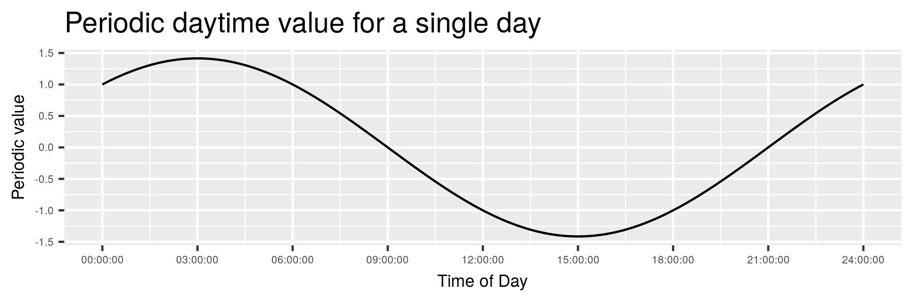
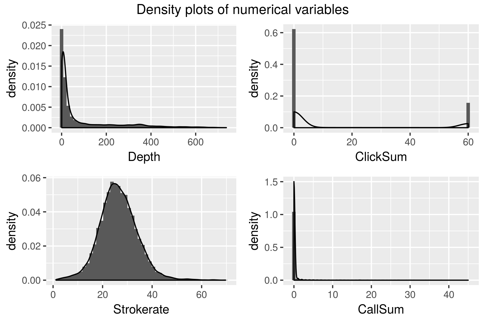
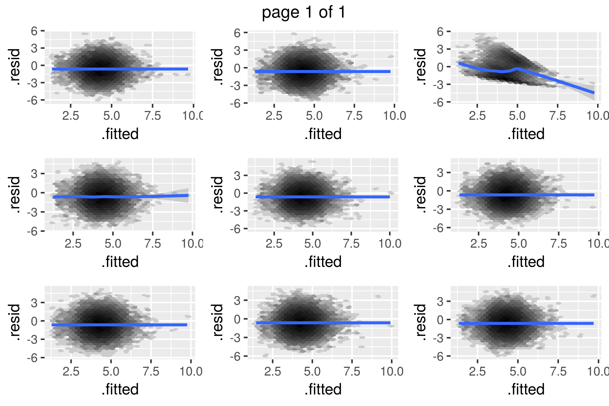
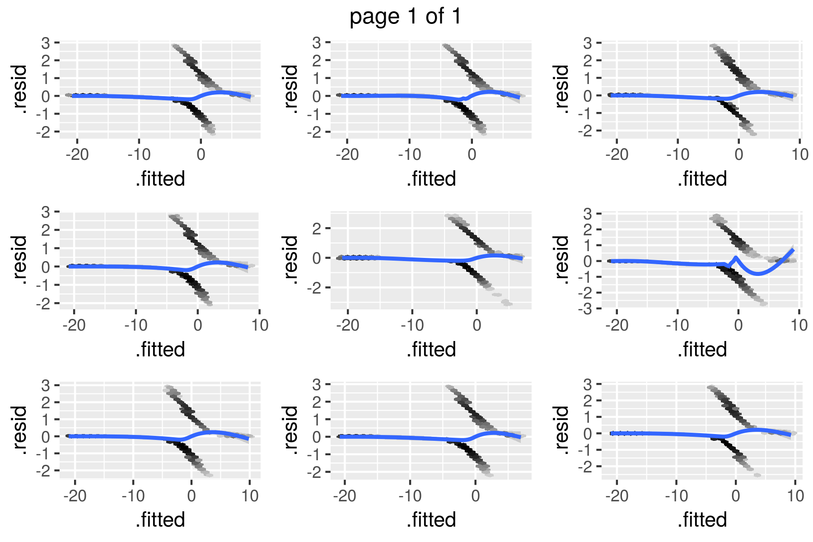
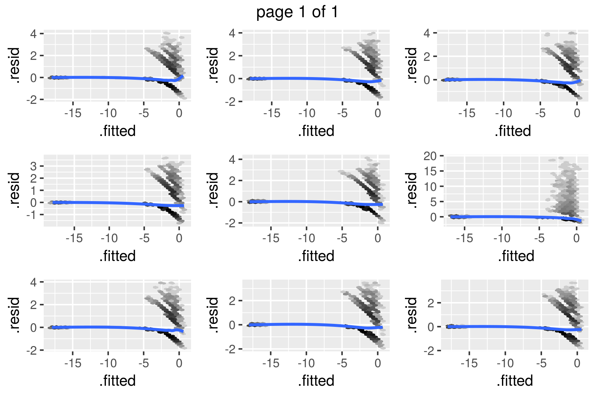

```{r setup, include=FALSE}
library(kableExtra)
library(dplyr)
knitr::opts_chunk$set(eval = TRUE)
knitr::opts_chunk$set(warning  = FALSE)
```


```{r read_data, include=FALSE}
fullrun <- TRUE
if (fullrun) {
  narwhal <- readRDS("outputs/narwhal_modified.RDS")
} else {
  narwhal <- readRDS("outputs/narwhal_modified_reduced.RDS")
}
```

In this report we will attempt to understand if the whales are affected by the presence of the seismic ship. We will be considering the following variables as measures of the whales behavior:

* `Depth`: Depth of the whale in meters below sea level
* `Call`: Whether a whale makes a call
* `Click`: Whether a whale makes a click
* `Buzz`: Whether a whale makes a buzz
* `ODBA`: Overall dynamic body acceleration
* `VeDBA`: Vector dynamic body acceleration
* `Strokerate`: Strokrate of tail of the whale

As we are interested in modelling the whales behavior these variables are all possible response variables in the final data analysis.  

# Data clean up/preparation
Before we can analyse the data we must clean up the data. The data set contains 1.058.507 data lines over 19 variables. From the description of the data in the problem description we can make the following initial changes:

* Combine `Date` and `Hour` to a new single time object called `Datetime`.
* Correct for positive `Depths` by subtracting the maximum value from all values
* Encode -1 as NA for those variables, where it applies

### Duplicate observations 
There are a few issues of duplicate observations. There were 16 identical observations and 4 observations which only differed sligthy in `Dist.to.Paamiut`. Looking at the table below we see that all 16 identical observations has `Dist.to.Paamiut` = NA.
For the 16 identical observations, one of each duplicates was deleted from the data set. The observation pairs 9, 10 and 11, 12 only differs very slightly in `Dist.to.Paamiut` so two new observations with `Dist.to.Paamiut` equal to the mean of `Dist.to.Paamiut` in each pair and all other attributes the same were added instead.    

```{r Duplicate_table, echo=FALSE}
Alldups <- readRDS("outputs/AllDuplicates.RDS")
Twodups <- readRDS("outputs/TwoDuplicates.RDS")
row.names(Twodups)[1:2] <- c("  "," ")
dups <- rbind(Alldups,Twodups)
dups[,c("Datetime","Ind","Depth","Dist.to.Paamiut")] %>%
  mutate(Dist.to.Paamiut = 
           cell_spec(Dist.to.Paamiut,
                     bold = ifelse(is.na(Dist.to.Paamiut), FALSE,TRUE),
                     color  = ifelse(is.na(Dist.to.Paamiut), "black","red"))) %>% 
kable(escape = F) %>% 
kable_styling(bootstrap_options = "striped", full_width = F, position = "left") %>% 
group_rows("Replacement for rows 9 and 10", 21, 21) %>%
group_rows("Replacement for rows 11 and 12", 22, 22) %>% 
row_spec(9:12,background = "#fca9b6") 
```


### NAs in `Strokerate`

Examining `Strokerate` after these operations shows that it has 686 NA values. The time periods where these NA values occur are shown in the table below.

```{r Strokerate_NAs, echo=FALSE}
NAStrokeDf <- readRDS("outputs/NAStrokeDf.RDS")
kable(NAStrokeDf) %>% 
  kable_styling(bootstrap_options = "striped", full_width = F, position = "left") %>% group_rows("NA intervals", 1, 3) %>%  group_rows("Time range for whole experiment", 4, 5) 
```

We see that Helge only has NAs in the first 32 measurements. Thor has in the first 578 measurements and the last 76 measurements. We assume that the first NAs are because the experiments were not yet properly started and the last are from the experiment "winding down". As these observations are such a small fraction of the full data set we simply remove them.
Thus the first 578 and last 76 observations are removed from "Thor" and the first 32 observations are removed from "Helge".

### Other missing values

However, the dataset still has missing values. In order to examine whether there is some systematism behind which values are missing, we plot the intersection of missing values:


We see that almost all missing values are present in the `Dist.to.Paamiut` variable, and that there is no clear tendency that other variables are missing simultaneously. 

To check whether there is any system as to when the NA's for `Dist.to.Paamiut` appear, we make a table with percentage of how many values are present in a given phase (0 is no values present in the phase, 100 is all values present, NaN is when no observations belong to the corresponding whale):


This table shows that except for the B-phase, there is no tendency in when the `Dist.to.Paamiut` values are missing if we split accordning to the phases. In the B-phase, however, there are **NO** `Dist.to.Paamiut` observations. Hence the observations are not missing at random and we do not wish to impute values. As almost 70\% of the observations in `Dist.to.Paamiut` are missing we will simply delete this variable from our data set.


In order to check when missing values appear for other variables, we plot the number of missing variables for the other variables with a somewhat large amount of NAs, separated by phases:


Not surprisisingly, the Lat and Long variables are missing simultaneously, indicating a GPS error. There is no tendency for `Dist.to.shore`. 

### Sun as factor

As a small novelty we have looked up the sunrise and sundown times august 16th 2017 latitude 70, longitude -27. The sun would have risen at 02:49 and went down at 20:50. From this data we have encoded a `Sun` variable encoding whether or not the sun was up or down at the time. <br>

### Time of day as periodic value

To be able to include the (potential) effect of the time of day even more precise than the `Sun` factor called `DaytimePeriodic`. This numerical variable encodes the time of day in a periodic manner. It is encoded such that the largest positive value corresponds to 15:00 and the (numerically) largest negative value corresponds to 03:00.



### Longitude, Latitude and area

We plot Long/lat against each other and color it by Datetime, to see if there are som oddities.

{width=750px}

As it seems that the whales are swiming "smoothly" around, we conclude that there are no obvious mistakes in the locations. 

Despite, even though the Lat/Long variables seem to have no obvious errors we have decidet not to include them in our models below. We suspect that the effect of Lat and Long is non-linear and that the interaction of the two variables have a non-linear effect. Including all of these effects in a suitable non-linear manner would require a large and complex model, which would be hard to interpret. 

The data collectores have however also included an `Area` variable. This area variable splits the Lat/Long combination into 5 destinct areas. We assume that the data collectors have chosen these areas in a sensible way, and that this `Area` variable will be a better covariate in the model. 

Hence we leave out `Lat` and `Long` from our models and instead use `Area`.

### Seismik determined by phase

A closer inspection of the variables `Seismik` and `Phase` yields that they  are extremely correlated, even though this was not found in the section on "Strongly correlated variables". Indeed, from the table below we see that `Seismik` is completely determined by `Phase`.

```{r, echo=FALSE}
x <- sapply(levels(narwhal$Phase), function(x) summary(narwhal$Seismik[narwhal$Phase == x]))
kable(data.frame(x)) %>% kable_styling(bootstrap_options = "striped", full_width = F, position = "left")
```

Therefore we remove the variable `Seismik` from the data set. 

# Exploratory data analysis

## Depth and phases:
The data we are considering is in fact time series data and as such it is not well suited for the types of models we are interested in. Furthermore the data set is quite large - it has more then a million data lines - and any fitting and plotting procedure will be a bit slow. 
To reduce this enormous data set we will start by looking if we can aggregate the data in some meaning full way.

By plotting the depth over time - colored according to phases - we see that the whales do a lot of short dives, and some very deep dives. We judge that there is no clear trend in time, nor any clear effect of the different phases. Considering the B phase as a control phase, there is also no clear difference before and during the experiments.


However we see that it seems possible to easily distinguish between when whale is diving and when it is not, by categorizing each periode of time under some set depth to be a dive. We chose this depth to be 10 meters. 

### Aggregrating the data
Thus we aggregate the data such that each observations corresponds to 1 minute. This gives us a new data set with the following summary statistics:

* `Ind`; factor;  whale name
* `Start` date time; first time point in the group
* `Depth` numeric; average depth
* `Phase` factor; phase of the first observation
* `Area` factor; area of the first observation
* `Acou.qua` numeric; the average acoustic quality
* `Dist.to.shore` numeric; average distance between the whale and the shore 
* `CallSum` numeric; number of calls that minute
* `ClickSum` numeric; number of clicks that minute
* `BuzzSum` numeric; number of buzz's that minute
* `ODBA` numeric; average overall dynamic body acceleration
* `VeDBA` numeric; vector dynamic body acceleration
* `StrokeRate` numeric; average stroke rate
* `Los` factor; whether the whale was in the line of sight in the first observation
* `Sun` factor; whether the sun was up or down at this time point 

Which yields a data set of 17.632 observations. As the data set consists of 16 variables, we will plot and analyze these variables in groups. There are 575 missing data points in `Dist.to.shore`. As we discussed in our section on "other missing values" it seems that there is no problem in simply removing these data lines. 

Hence our final complete data set has 17.057 observations in 16 variables. 


### Strongly correlated variables
Before we spend to much time inspecting each variable we examin if there are any of the variables, that are strongly correlated. 


On the left we see a correlation plot for the numerical variables. The variables `ODBA` and `VeDBA` are strongly correlated with a corelation coeficient of 0.997. We remove `VeDBA` to avoid collinearity. 


On the right we see a correlation plot for the categorical variables. This plot gives the impression that there is no extreme correlation between most of the categorical variables. However `BuzzSum` and `ClickSum` are highly correlated. Moreover `BuzzSum` and `ClickSum` are both among our potential response variables, and as such modeling both of these would result in similar models. We remove `BuzzSum`.


### The potential response variables

Let us first look at our remaining potential respons variables. First we make density plots.

```{r new_data_readin, include=FALSE}
narwhal <- readRDS("outputs/narwhal_Minut.RDS")
```


```{r sum_response}
summary(narwhal[,c("Depth", "Strokerate", "CallSum", "ClickSum")])
```

{width=750px}

First of all we not that all these variables take values on the positive reals and hence when fitting we should only consider GLM's where the conditional distribution of our responses takes values on the positive reals. Examples of such distributions are the Poisson, Gamma, Binomial. Regarding the individual potential response variables we note that

* `Depth` is very skewed with a mean much larger than the median and a max value much greater that both median, mean and 3rd. quantile. When fitting, it would probably be a good idea to use a transformation to control the skewness of `Depth`. Below we have plottet log of `Depth` and in this plot the is no heavy tails. In the fitting we will use a Gamma distribution with the log link to model the conditional distribution of `Depth`.
* `Strokerate` has a rather nice marginal distribution. There might be a small tail to the right. We will use a Poisson distribution with the cononical log link to model the conditional distribution of `Strokerate`.
* `ClickSum` is extreemly bi-modal. We create a binary version of this variable, where all values above 20 is set to 1 and all values below are set to 0. We call this new variable `ClickBi` and it should be model using the Binomial distribution with a logit link.
* `CallSum` is very skewed. We found no obviuos transformation to do. As `CallSum` is allowed to be zero we can not use the Gamma distribution. In stead we will use the Poisson distribution with a log link to model the conditional distribution of `CallSum`.

{width=750px}


### The categorical explanatory variables
We now consider the categorical explanatory variables. 

```{r sum_cat_explanatory}
summary(narwhal[,c("Phase", "Area", "Acou.qua", "Ind", "Los")])
```

From the summary, there is no reason to be suspicious of any large errors, but we note that

* We have more observations on the whale "Helge" than on "Thor"
* A lot of the data points belong to phase "B"
* `Acou.qua` are almost always "G".


### The numeric explanatory variables
Lastly we turn to the only numerical explanatory variable. 
```{r sum_num_explanatory}
summary(narwhal[,c("Dist.to.shore","ODBA")])
```

{width=750px}


We see that both `Dist.to.shore` and `ODBA` have tailes to the right. It could be interesting to examin if a transformation of these two variables would give a better fit below, but due to time constraints we leave them as they are. 


## Phasesub

We have chosen to work with the factor `Phasesub` in stead of `Phase`. `Phasesub` is a coarser factor then `Phase`, differentiating only between whether we are in an B, T or I Phase and not the phasenumber. It is created in the following way

```{r}
narwhal$Phasesub <- factor(narwhal$Phase, ordered = F) 
levels(narwhal$Phasesub) <- list("B" = c("B"),
                                 "T" = c("T0", "T1", "T2", "T3", "T4", "T5"),
                                 "I" = c("I0", "I1", "I2", "I3", "I4", "I5"))
```

This choise is made, as `Phasesub` is better suited to answer our scientific question. We can the interpret the estimated effect of `Phasesub` equal to I as the effect of the boat, and the estimates effect of `Phasesub` equal to T as the effect of the boat and seismic activity together.  


# Data Analysis and modeling

We wish to examine whether or not the behavior of the whales is affected by the boat and airgun.

For this purpose we will fit a generalized linear models over our aggregated datasets and estimate the effect of our various explanatory variables on our 4 respons variables. In the section "The potential response variables" we decided to use the following regression models

* `Depth` Gamma distibution with log link
* `ClickBi` Binomial distribution with logit link
* `CallSum` Poisson distribution with log link 
* `Strokerate` Poisson distribution with log link

To answer our scientific question we are in fact only really interested in the estimated effects of the `Phasesub` variable, as this is the variables that encodes the presence of the Paamiut ship and shooting. We do however keep as many explanatory variables in the model as possible to adjust for potential confounders between the responses of interest and `Phasesub`. 

We will however never allow one of the respons variables to be an explanatory variable in another model. 

To judge goodness of fit we will look at residual plots. We will plot the observed residual plot among 8 residual plots based on data simulated under the model. If the is sufficient goodness of fit we will report the estimated effect of the B, T and I phases. 


## Model 1: Depth

We fit our Depth model.

```{r}
fit.depth <- glm(Depth ~ Phasesub + Area + Ind + Los + Sun + ODBA + Dist.to.shore,                  data = narwhal, family = Gamma(link = "log"))
```

In the below plot we have the residual plot of the observed data along with 8 residual plots created from simulated data.





Quite clearly in this plots, one of the residual plots vary from the others. We conclude that the Depth model does not describe any relationship between the descriptive variables that may be in the original dataset. 

The models were we instead have Click or Call as response variable also yield residual plots with one very distinguishable dataseet, and so we also disregard these models.


Quite clearly in both plots, one of the residual plots vary from the others. We conclude that the Depth model does not describe any relationship between the descriptive variables that may be in the original data set.

The models were we instead have Click or Call as response variable also yield residual plots with one very distinguishable data set, and so we also disregard these models.

## Model 2: ClickBi

We fit our Click model.

```{r}
fit.click <- glm(ClickBi ~ Phasesub + Area + Ind + Los + Sun + ODBA + Dist.to.shore + Acou.qua, data = narwhal, family = "binomial")
```




## Model 3: CallSum

We fit our Call model.

```{r}
fit.call <- glm(CallSum ~ Phasesub + Area + Ind + Los + Sun + ODBA + Dist.to.shore + Acou.qua, data = narwhal, family = "poisson")
```





## Model 4: Strokerate

We fit our strokerate model.

```{r}
fit.strokerate <- glm(Strokerate ~ Phasesub + Area + Ind + Los + Sun + ODBA + Dist.to.shore, data = narwhal, family = "poisson")
```
  


While the original data set is still distinguishable among the 8 simulated data sets, it does look like the data could be distributed as the model predicts - however, the tails seem a bit too heavy. As a next step, we could add splines to the model in e.g. the different quantiles and see whether the heavy tails could be fixed. The price, however, would be less interpretability of the model.


## Conclusion

Our analysis of the data set started out with a cleaning of the data. Firstly, we combined some variables, removed co-linear variables and aggregated the data into intervals. Further, by plotting different explanatory variables, we deemed some variables to not have any significance for the response variables we had selected beforehand. These explanatory variables were then discarded.

We then continued into the analysis of our data set. We tested various models for our selected response variables, but only the model of Strokerate seemed to be somewhat accurate. However, even this model had problems with heavy tails. As a solution to this, we wish to experiment with splines.

As we were not able to test down into the submodel with `Phasesub` in any of the four models
we were not able to make any conclusions on the effect of the boat or shooting the the behavior 
of the whales. 


```{r, include = FALSE}
## Appendix


#**INDSÆT EVT PLOT MED DISTANCE + Missing + phases**

#```{r include=FALSE}
#**INDSÆT EVT PLOT MED DISTANCE + Missing + phases**
#```
```
