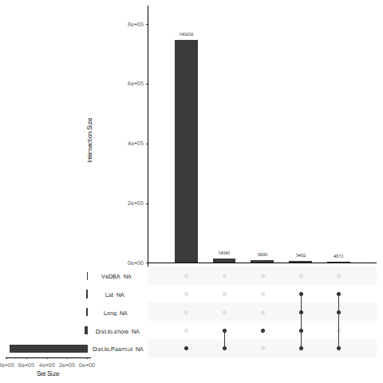
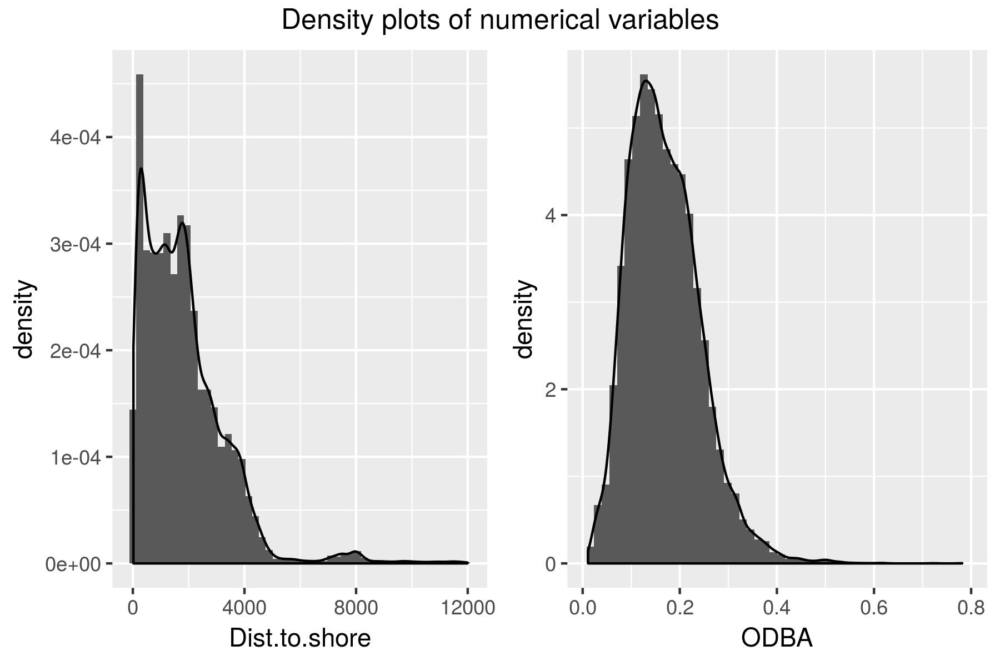

```{r setup, include=FALSE}
library(kableExtra)
library(dplyr)
knitr::opts_chunk$set(eval = TRUE)
knitr::opts_chunk$set(warning  = FALSE)
```


```{r read_data, include=FALSE}
fullrun <- TRUE
if (fullrun) {
  narwhal <- readRDS("outputs/narwhal_modified.RDS")
} else {
  narwhal <- readRDS("outputs/narwhal_modified_reduced.RDS")
}
```

In this report we will attempt to understand if the whales are affected by the presence of the seismic ship. We will be considering the following variables as measures of the whales behavior:

* `Depth`: Depth of the whale in meters below sea level
* `Call`: Whether a whale makes a call
* `Click`: Whether a whale makes a click
* `Buzz`: Whether a whale makes a buzz
* `ODBA`: Overall dynamic body acceleration
* `VeDBA`: Vector dynamic body acceleration
* `Strokerate`: Strokrate of tail of the whale

As we are interested in modelling the whales behavior these variables are all possible response variables in the final data analysis.  

# Data clean up/preparation
Before we can analyse the data we must clean up the data. The data set contains 1.058.507 data lines over 19 variables. From the description of the data in the problem description we can make the following initial changes:

* Combine `Date` and `Hour` to a new single time object called `Datetime`.
* Correct for positive `Depths` by subtracting the maximum value from all values
* Encode -1 as NA for those variables, where it applies

### Duplicate observations 
There are a few issues of duplicate observations. There were 16 identical observations and 4 observations which only differed sligthy in `Dist.to.Paamiut`. Looking at the table below we see that all 16 identical observations has `Dist.to.Paamiut` = NA.
For the 16 identical observations, one of each duplicates was deleted from the data set. The observation pairs 9, 10 and 11, 12 only differs very slightly in `Dist.to.Paamiut` so two new observations with `Dist.to.Paamiut` equal to the mean of `Dist.to.Paamiut` in each pair and all other attributes the same were added instead.    

```{r Duplicate_table, echo=FALSE}
Alldups <- readRDS("outputs/AllDuplicates.RDS")
Twodups <- readRDS("outputs/TwoDuplicates.RDS")
row.names(Twodups)[1:2] <- c("  "," ")
dups <- rbind(Alldups,Twodups)
dups[,c("Datetime","Ind","Depth","Dist.to.Paamiut")] %>%
  mutate(Dist.to.Paamiut = 
           cell_spec(Dist.to.Paamiut,
                     bold = ifelse(is.na(Dist.to.Paamiut), FALSE,TRUE),
                     color  = ifelse(is.na(Dist.to.Paamiut), "black","red"))) %>% 
kable(escape = F) %>% 
kable_styling(bootstrap_options = "striped", full_width = F, position = "left") %>% 
group_rows("Replacement for rows 9 and 10", 21, 21) %>%
group_rows("Replacement for rows 11 and 12", 22, 22) %>% 
row_spec(9:12,background = "#fca9b6") 
```

### NAs in `Strokerate`

Examining `Strokerate` after these operations shows that it has 686 NA values. The time periods where these NA values occur are shown in the table below.

```{r Strokerate_NAs, echo=FALSE}
NAStrokeDf <- readRDS("outputs/NAStrokeDf.RDS")
kable(NAStrokeDf) %>% 
  kable_styling(bootstrap_options = "striped", full_width = F, position = "left") %>% group_rows("NA intervals", 1, 3) %>%  group_rows("Time range for whole experiment", 4, 5) 
```

We see that Helge only has NAs in the first 32 measurements. Thor has in the first 578 measurements and the last 76 measurements. We assume that the first NAs are because the experiments were not yet properly started and the last are from the experiment "winding down". As these observations are such a small fraction of the full data set we simply remove them.
Thus the first 578 and last 76 observations are removed from "Thor" and the first 32 observations are removed from "Helge".

### Other missing values

However, the dataset still has missing values. In order to examine whether there is some systematism behind which values are missing, we plot the intersection of missing values:


We see that almost all missing values are present in the `Dist.to.Paamiut` variable, and that there is no clear tendency that other variables are missing simultaneously. 

To check whether there is any system as to when the NA's for `Dist.to.Paamiut` appear, we make a table with percentage of how many values are present in a given phase (0 is no values present in the phase, 100 is all values present, NaN is when no observations belong to the corresponding whale):


This table shows that except for the B-phase (and the missing datapoints for Thor), there is no tendency in when the `Dist.to.Paamiut` values are missing.

In order to check when missing values appear for other variables, we plot the number of missing variables for the other variables with a somewhat large amount of NAs, separated by phases:


Not surprisisingly, the Lat and Long variables are missing simultaneously, indicating a GPS error. There is no tendency for `Dist.to.shore`.


### Sun as factor

As a small novelty we have looked up the sunrise and sundown times august 16th 2017 latitude 70, longitude -27. The sun would have risen at 02:49 and went down at 20:50. From this data we have encoded a `Sun` variable encoding whether or not the sun was up or down at the time. <br>

### Checking correctnes of Long/Lat

We plot Long/lat against each other and color it by Datetime, to see if there are som oddities.

{width=750px}

As it seems that the whales are swiming "smoothly" around, we conclude that there are no obvious mistakes in the locations.  

# Exploratory data analysis

## Depth and phases:
The data we are considering is in fact time series data and as such it is not well suited for the types of models we are interested in. Furthermore the data set is quite large - it has more then a million data lines - and any fitting and plotting procedure will be a bit slow. 
To reduce this enormous data set we will start by looking if we can aggregate the data in some meaning full way.

By plotting the depth over time - colored according to phases - we see that the whales do a lot of short dives, and some very deep dives. We judge that there is no clear trend in time, nor any clear effect of the different phases. Considering the B phase as a control phase, there is also no clear difference before and during the experiments.


However we see that it seems possible to easily distinguish between when whale is diving and when it is not, by categorizing each periode of time under some set depth to be a dive. We chose this depth to be 10 meters. 

### Aggregrating the data
Thus we aggregate the data such that each observations corresponds to 1 minute. This gives us a new data set with the following summary statistics:

* `Ind`; factor;  whale name
* `Start` date time; first time point in the group
* `Depth` numeric; average depth
* `Seismik` numeric; average number of seismic activity pr second
* `Phase` factor; phase of the first observation
* `Area` factor; area of the first observation
* `Call` numeric; number of calls that minute
* `Acou.qua` numeric; the average acoustic quality
* `Dist.to.Paamiut` numeric; average distance to Paamiut 
* `Dist.to.shore` numeric; average distance between the whale and the shore 
* `Click` numeric; number of clicks that minute
* `Buzz` numeric; number of buzz's that minute
* `ODBA` numeric; average overall dynamic body acceleration
* `VeDBA` numeric; average vector dynamic body acceleration
* `StrokeRate` numeric; average stroke rate
* `Los` factor; whether the whale was in the line of sight in the first observation
* `Lat` numeric; average latitude
* `Long` numeric; average longitude
* `Sun` factor; whether the sun was up or down at this time point 
* `Dive` logical; whether the whale was diving (diving starts at 10 meters)

Which yields a data set of 17.632 observations. As the data set consists of 20 variables, we will plot and analyze these variables in groups. 

### The potential response variables

Let us first look at our potential respons variables. First we make density plots.

```{r new_data_readin, include=FALSE}
narwhal <- readRDS("outputs/narwhal_Minut.RDS")
```


```{r sum_response}
summary(narwhal[,c("Depth", "ODBA", "VeDBA", "Strokerate", "Call", "Click", "Buzz")])
```
{width=750px}

We note that

* `Depth` is very skewed with a mean much larger than the median and a max value much greater that both median, mean and 3rd. quantile. 
* `ODBA` and `VeDBA` are on the same magnitude and both have some negative values.

Now we consider the correlation between these variables and most notably we find
that `ODBA` and `VeDBA` are correlated with correlation coefficient 0.997, and that
`Call` and `Buzz` are in fact totally correlated with a correlation coefficient of 1. 

```{r}
cor(narwhal$ODBA, narwhal$VeDBA)
cor(narwhal$Call, narwhal$Buzz)
```

This leads us the remove `VeDBA` and `Buzz` from the dataset.


### The categorical explanatory variables
We now consider the categorical explanatory variables. 

```{r sum_cat_explanatory}
summary(narwhal[,c("Seismik", "Phase", "Area", "Acou.qua", "Ind", "Los")])
```

We note that

* We have more observations on the whale "Helge" than on "Thor"
* `Acou.qua` are almost always "G".
A correlation plot for the categorical variables gives the impression that there is no extreme correlation between the categorical variables:


Therefore the above plot does not force us to disregard any of the variables.

However, a closer inspection yields that the variables `Seismik` and `Phase` are indeed very correlated. Indeed, from the table below we see that `Seismik` is completely determined by `Phase`.

```{r, echo=FALSE}
x <- sapply(levels(narwhal$Phase), function(x) summary(narwhal$Seismik[narwhal$Phase == x]))
kable(data.frame(x)) %>% kable_styling(bootstrap_options = "striped", full_width = F, position = "left")
```


### The numeric explanatory variables
Lastly we turn to the numerical explanatory variables. 
```{r sum_num_explanatory}
summary(narwhal[,c("Dist.to.Paamiut", "Dist.to.shore", "Lat", "Long")])
```

{width=750px}

Since Lat and Long together determines an position we can't conclude anything about locations from looking at their densities.

```{r include = FALSE}
### Conclusions and choices made from exploratory data analysis
#* `ODBA` and `VeDBA` are strongly correlated and either can be chosen as a response.
#* By looking at `Depth` we can partion the data into distinctive Dives.
#* **SOMETHING WITH NAs in DIST TO PAARMIUT**

### Choices made from exploratory data analysis

#* Remove `Dist.to.Paamiut`
```

## Aggregation of phases

In the following data analysis, we will fit models to a factor consisting of the different phases as well as a aggregated factor of the phases, differentiating only between whether or not we are in a Test phase (i.e. if there is seismic activity from the airgun or not). 

# Data Analysis and modeling

We wish to examine whether or not the behavior of the whales is affected by the boat and airgun.

For this purpose we will fit a generalized linear models over our aggregated datasets and estimate the effect of our various explanatory variables. In all four models we choose
the Poisson distribution with the log link to describe the conditional distribution of 
our response variables given our explanatory variables. The Poisson distribtion is chosen as 
all four variables `Depth`, `Click`, `Call` and `strokerate` takes values on the positive
reals and moreover both `Click` and `Call`are indeed counting variables. 

To answer our scientific question we are in fact only really interested in the estimated
effects of the `Phase` variable, as this is the variables that encodes the presence of the
Paamiut ship and shooting. We do however keep as many explanatory variables in the model as possible to adjust for potential confounders between the responses of interest and `Phase`. 

We will however never allow one of the responsvariables to be an explanatory variable in 
another model. 

As the current `Phase` variable has multiple shoting phases we are in fact more 
interested in the variable `Phasesub` which we create below. This new variable
collapses all T-phases (boat is present and shooting) and I-phases (boat is present and not shooting).  

```{r}
narwhal$Phasesub <- narwhal$Phase
levels(narwhal$Phasesub) <- list("B" = c("B"),
                                 "T" = c("T0", "T1", "T2", "T3", "T4", "T5"),
                                 "I" = c("I0", "I1", "I2", "I3", "I4", "I5"))
```


To judge goodness of fit we will look at residual plots. We will plot the observed residual
plot among 8 residual plots based on data simulated under the model. If we judge the fit 
to be adequate we will then compare this model to the submodel where we use the `Phasesub` 
variable instead of `Phase`. This comparison is done via a Likelihood Ratio Test. If this test 
suggests that the submodel can not be rejected we will accept this new model with `Phasesub`
and report estimated effect of the B, T and I phases. 

In the following we will present some different models with different response variables. We have chosen the four response variables Depth, Click, Call and Strokerate. 


## Model 1: Depth (And Click / Call models)

We fit a generalized linear model with Depth as a response variable. We choose the exponential family to be the Poisson family, as the `Depth` variable takes values on the positive reals 
and could seem to have 


```{r}
fit.depth <- glm(Depth ~ Phase + Area + Ind + Los + Sun + ODBA, data = narwhal, family = "poisson")
```


Fitting these models and simulating 8 new data sets with the fitted models as the true models yields the following plots:


Quite clearly in this plots, one of the residual plots vary from the others. We conclude that the Depth model does not describe any relationship between the descriptive variables that may be in the original dataset. 

The models were we instead have Click or Call as response variable also yield residual plots with one very distinguishable dataseet, and so we also disregard these models.


Quite clearly in both plots, one of the residual plots vary from the others. We conclude that the Depth model does not describe any relationship between the descriptive variables that may be in the original data set.

The models were we instead have Click or Call as response variable also yield residual plots with one very distinguishable data set, and so we also disregard these models.

## Strokerate model

Similary, we fit a generalized linear model now with the Strokerate variable as response:

```{r}
fit.strokerate <- glm(Strokerate ~ Phase + Area + Ind + Los + Sun + ODBA, data = narwhal, family = "poisson")
```
  


While the original data set is still distinguishable among the 8 simulated data sets, it does look like the data could be distributed as the model predicts - however, the tails seem a bit too heavy. As a next step, we could add splines to the model in e.g. the different quantiles and see whether the heavy tails could be fixed. The price, however, would be less interpretability of the model.

For now, however, we will create the submodel and plot residuals

```{r}
fit.strokerate.sub <- glm(Strokerate ~ Phasesub + Area + Ind + Los + Sun + ODBA, data = narwhal, family = "poisson")
```


Again the observed residual plot is identifiable, but we will accept the fit.

```{r}
anova(fit.strokerate, fit.strokerate.sub, test = "LRT")
```


We see that the Likelihood ratio test rejects the submodel. Hence we must stay 
with the larger model that does not allow us to conclude anything about the effect 
of the boat or shooting on the whales. 

## Conclusion

Our analysis of the data set started out with a cleaning of the data. Firstly, we combined some variables, removed co-linear variables and aggregated the data into intervals. Further, by plotting different explanatory variables, we deemed some variables to not have any significance for the response variables we had selected beforehand. These explanatory variables were then discarded.

We then continued into the analysis of our data set. We tested various models for our selected response variables, but only the model of Strokerate seemed to be somewhat accurate. However, even this model had problems with heavy tails. As a solution to this, we wish to experiment with splines.

As we were not able to test down into the submodel with `Phasesub` in any of the four models
we were not able to make any conclusions on the effect of the boat or shooting the the behavior 
of the whales. 


```{r, include = FALSE}
## Appendix


#**INDSÆT EVT PLOT MED DISTANCE + Missing + phases**

#```{r include=FALSE}
#**INDSÆT EVT PLOT MED DISTANCE + Missing + phases**
#```
```
