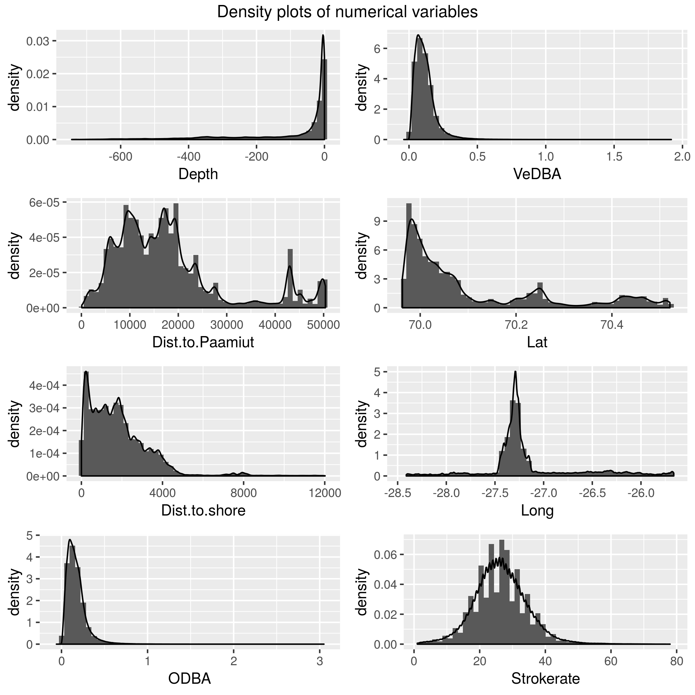
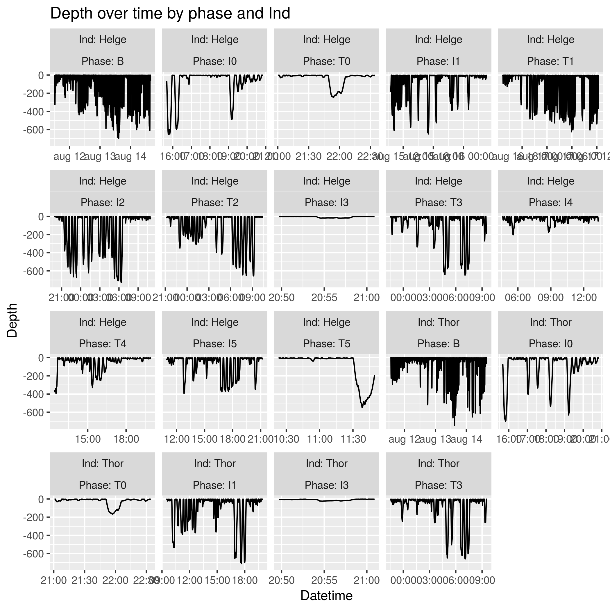
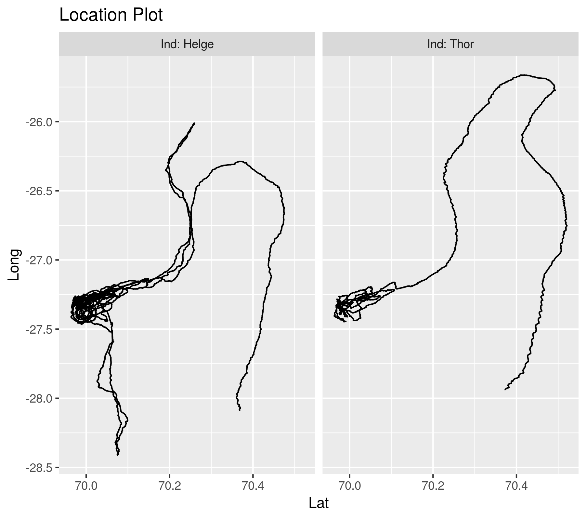

```{r setup, include=FALSE}
fullrun <- TRUE
if (fullrun) {
  narwhal <- readRDS("outputs/narwhal.RDS")
} else {
  narwhal <- readRDS("outputs/narwhal_reduced.RDS")
}
narwhal <- readRDS("outputs/narwhal.RDS")
knitr::opts_chunk$set(echo = TRUE)
```

## Data wrangling
**Corrections made**

* Change all variables to have capitalized start letter
* Change *Strokerate* to be of type "integer" instead of "numerical"
* Combine *Date* and *Hour* to a new single time object called *Datetime*.
* Correct for positve *Depths* (by substracting maximum value from all values)
* Remove duplicate rows
* Add binary variable indicating if both whales are present

## Exploratory analysis
```{r summaries}
summary(narwhal[,c(3:19)])
table(narwhal[,c("Ind","Phase")])
```

### Plot af numeriske variable



Vi ser at

* Strokerate er "hakket" fordi det kun er integers




### Ideas/Thoughts

* Make a binary *Phase* variable with level *T* and *I*
* Partion binary variables (such as *Calls*) into intervals (e.g. 30 second intervals around each call)
* Make A binary *Diving* variable by partioning the Depth variable.
* Pay attention to *Data leakage* (When you predict something using data which is not availiable at prediction time.)
* Make correlation plot
* Area is likely just a Long and Lat with broader categories
* Should we use both whales? Given that one of the appears only in some trials 